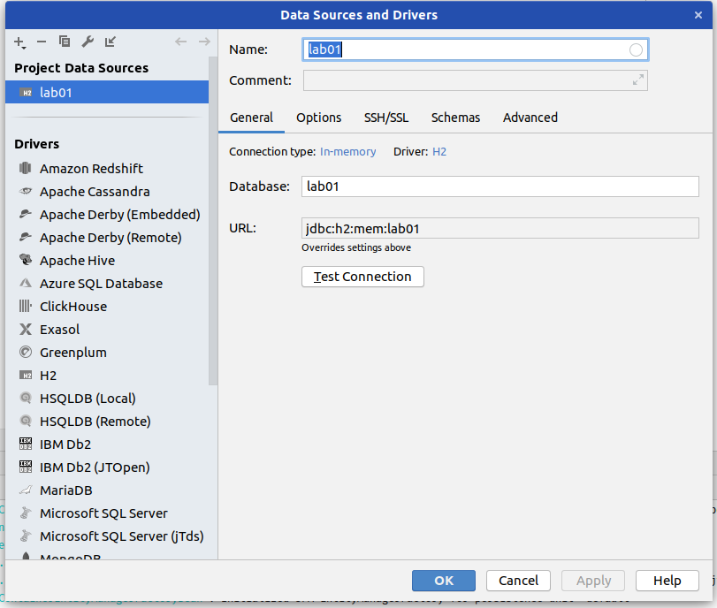

# Spring

[Initializr](https://start.spring.io/)

Dependencies:

- Dev Tools
- Web
- Data JPA
- H2 / Postgres
- Validation

`/h2-console` -> H2-Web-Oberfläche

application.properties:

```
server.port=8080
spring.datasource.url=jdbc:h2:mem:lab01
```

SQL files in resources-ordner
wenn `data.sql` genannt -> automatisch geladen

## Data Source festlegen

Connection type auf in-memory stellen
H2 auswählen

